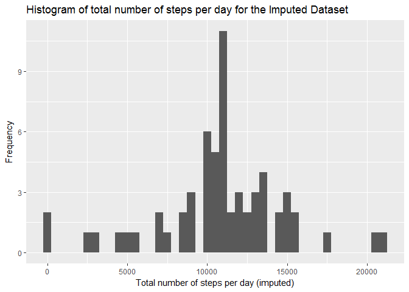

# Reproducible Research: Peer Assessment 1


## Loading required packages
The following peice of code will install (if required) and load the required packages used in this assignment.

```r
if(!require(dplyr))
{    
    install.packages(dplyr)
    library(dplyr)
}
if(!require(ggplot2))
{    
    install.packages(ggplot2)
    library(ggplot2)
}
if(!require(lubridate))
{    
    install.packages(lubridate)
    library(lubridate)
}
```

## Loading and preprocessing the data
We will now download and extract the dataset, if the required files do not already exist in the working directory. Then we are going to read the dataset.

```r
URL = "https://d396qusza40orc.cloudfront.net/repdata%2Fdata%2Factivity.zip"
dest = "repdata_data_activity.zip"
file1 = "activity.csv"
if(!file.exists(dest))
    download.file(URL, dest)
if(!file.exists(file1))
    unzip(dest)
act = read.csv(file1, colClasses = c("numeric","Date","numeric"))
```

## What is mean total number of steps taken per day?
For this part of the assignment, we will ignore the missing values in the dataset.

### 1. The total number of steps taken per day
The total number of steps taken per day will be stored in "steps_per_day" data frame tbl. We will use the dplyr package to accomplish this.


```r
steps_per_day = act %>% 
            group_by(date) %>% 
            summarize(total_steps = sum(steps,na.rm=T))

head(steps_per_day)
```

```
## # A tibble: 6 x 2
##         date total_steps
##       <date>       <dbl>
## 1 2012-10-01           0
## 2 2012-10-02         126
## 3 2012-10-03       11352
## 4 2012-10-04       12116
## 5 2012-10-05       13294
## 6 2012-10-06       15420
```

### 2. Histogram of the total number of steps taken each day
We will plot the histogram using the ggplot2 package.

```r
qplot(steps_per_day$total_steps, binwidth = 500, xlab = "Total number of steps per day", ylab = "Frequency", main = "Histogram of total number of steps per day")
```

<!-- -->

### 3. The mean and median of the total number of steps taken per day
Mean and median are calculated and reported below.

```r
mean_steps_per_day = mean(steps_per_day$total_steps)
median_steps_per_day = median(steps_per_day$total_steps)
```

- **Mean steps taken per day = 9354.2295082**
- **Median steps taken per day = 1.0395\times 10^{4}**

## What is the average daily activity pattern?
Now, we calculate the average number of steps for an interval across all days. We will accomplish this using the dplyr package.

```r
steps_per_interval = act %>% 
                    group_by(interval) %>% 
                    summarize(avg_steps = mean(steps,na.rm=T))

head(steps_per_interval)
```

```
## # A tibble: 6 x 2
##   interval avg_steps
##      <dbl>     <dbl>
## 1        0 1.7169811
## 2        5 0.3396226
## 3       10 0.1320755
## 4       15 0.1509434
## 5       20 0.0754717
## 6       25 2.0943396
```

### 1. Time series plot of interval and the number of steps, averaged across all days
Plotting the time series from the above data fram tbl using the ggplot package:

```r
qplot(interval, avg_steps, data = steps_per_interval, geom = "line", xlab = "5-minute interval", ylab = "Average number of steps across all days", main = "Time series plot of interval and the number of steps, averaged across all days")
```

<!-- -->

### 2. Which 5-minute interval contains the maximum number of steps?


```r
max_interval = steps_per_interval[which.max(steps_per_interval$avg_steps),1]
```
**The 5-minute interval containing the maximum number of steps, on average across all the days in the dataset, is 835.**


## Imputing missing values
There are a number of days/intervals where there are missing values.

### 1. The total number of missing values in the dataset

```r
miss_vals = sum(is.na(act$steps))
```
**The total number of missing values in the dataset is 2304.**

### 2. A strategy for filling in all of the missing values in the dataset.
**To fill in the missing values of the 5-minute intervals, we will use the mean of the available 5-minute intervals averaged across all days.** Note that we have already calculated these values in the previous exercise.

### 3. Create a new dataset that is equal to the original dataset but with the missing data filled in.
The new dataframe is called "act_imputed". The missing values are filled according to the above strategy.

```r
act_imputed = act
for(i in 1:length(act_imputed$steps))
{
    if(is.na(act_imputed$steps[i]))
    {
        idx = which(steps_per_interval$interval==act_imputed$interval[i])
        act_imputed$steps[i] = steps_per_interval$avg_steps[idx]
    }
}
```

### 4(a) A histogram of the total number of steps taken each day

```r
steps_per_day_imputed = act_imputed %>% 
    group_by(date) %>% 
    summarize(total_steps = sum(steps,na.rm=T))

qplot(steps_per_day_imputed$total_steps, binwidth = 500, xlab = "Total number of steps per day (imputed)", ylab = "Frequency", main = "Histogram of total number of steps per day for the Imputed Dataset")
```

<!-- -->

### 4(b) The mean and median total number of steps taken per day

```r
mean_steps_per_day_imputed = mean(steps_per_day_imputed$total_steps)
median_steps_per_day_imputed = median(steps_per_day_imputed$total_steps)
```

- **Mean steps taken per day for the imputed dataset = 1.0766189\times 10^{4}**
- **Median steps taken per day for the imputed dataset = 1.0766189\times 10^{4}**

### 4(c) Impact of missing data and difference in mean and median
The mean and median are different from the previous case when there were missing values in the dataset. But the difference in values is not too significant and we can say that **there is not a significant impact of missing data on the estimates of the total daily number of steps.**

## Are there differences in activity patterns between weekdays and weekends?
We will use the dataset with the filled-in missing values for this part.

### A new factor variable indicating weekday or weekend
The column day in the new dataset act_wday will indicate whether the day is a weekday or weekend.

```r
act_wday = act_imputed %>% 
    mutate(day = as.factor(ifelse(wday(date)>1 & wday(date)<7,"weekday","weekend")))

head(act_wday)
```

```
##       steps       date interval     day
## 1 1.7169811 2012-10-01        0 weekday
## 2 0.3396226 2012-10-01        5 weekday
## 3 0.1320755 2012-10-01       10 weekday
## 4 0.1509434 2012-10-01       15 weekday
## 5 0.0754717 2012-10-01       20 weekday
## 6 2.0943396 2012-10-01       25 weekday
```
    
### A panel plot containing a time series plot of the 5-minute interval and the average number of steps taken, averaged across all weekday days or weekend days


```r
act_wday = act_wday %>%
    group_by(interval,day) %>% 
    summarize(avg_steps = mean(steps,na.rm=T))

qplot(interval, avg_steps, data = act_wday, geom = "line", facets = day~., xlab = "5-minute interval", ylab = "Average number of steps across all days", main = "Time series plot of interval and the number of steps, averaged across all days")
```

<!-- -->


